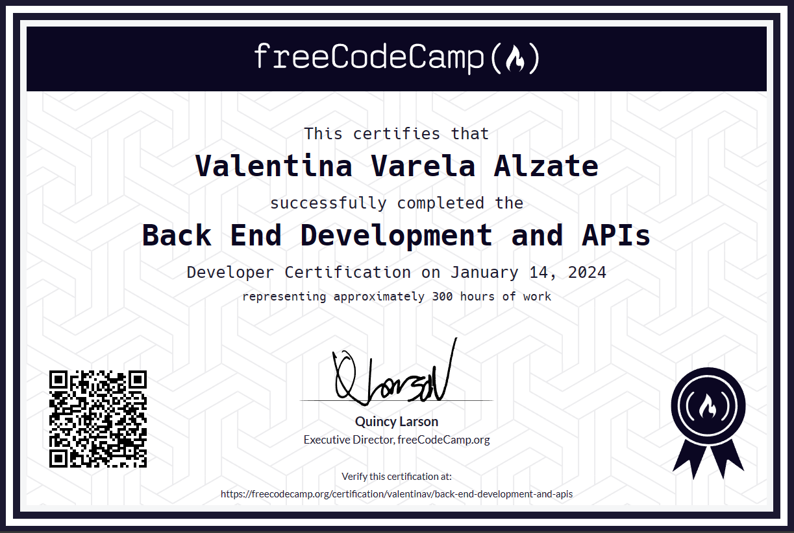
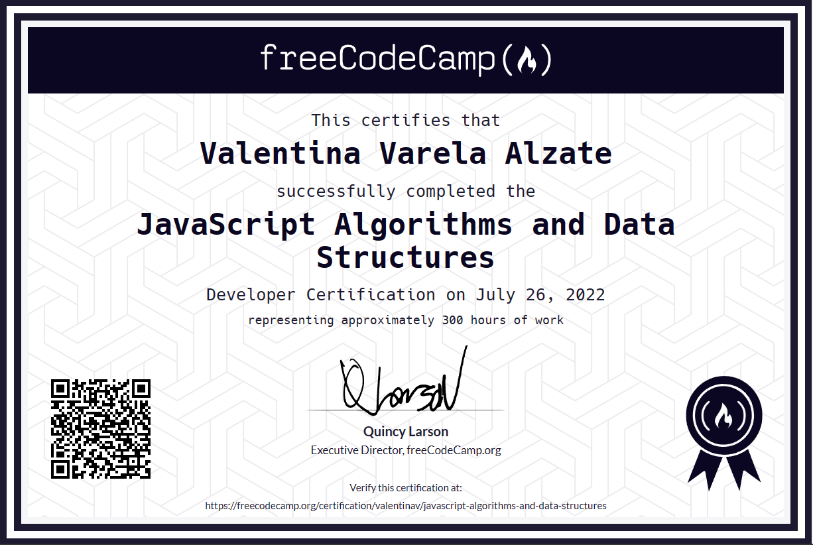
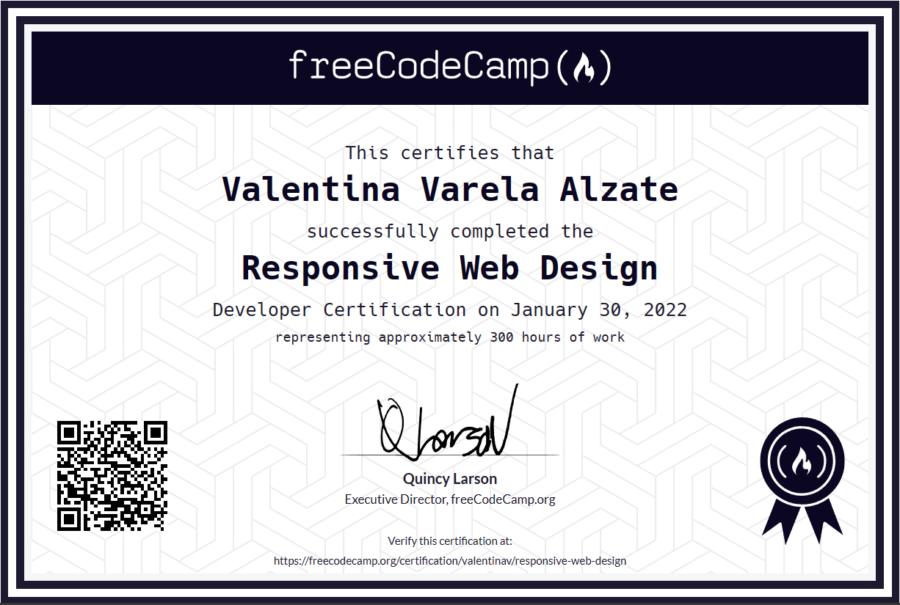

# Courses and certifications 🚀

I use this repository as a central archive where I compile all the courses I've completed, along with the projects associated with each and their certifications. 

Here you will find a variety of topics, from web development to data science, reflecting my journey of learning and professional growth.

  

      

          

          

          

      

  

